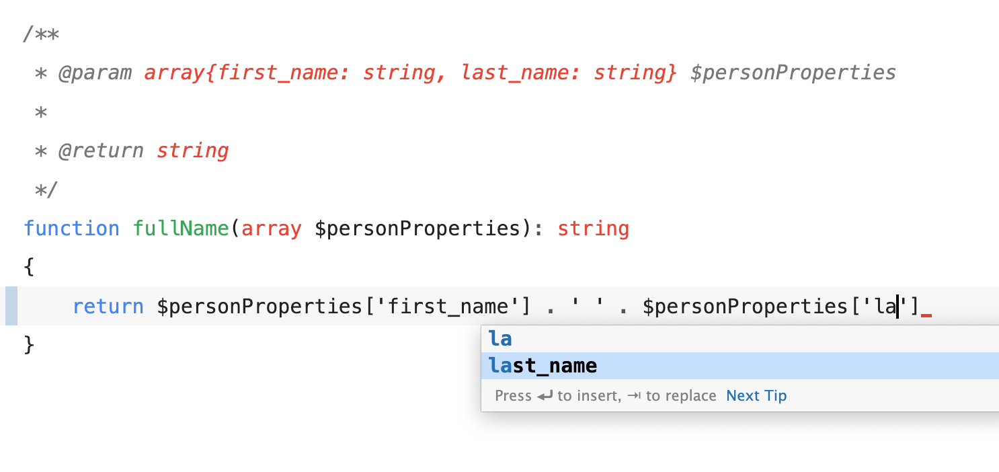

# Coding Styleguides

## Introduction

This document contains procedures for creating and writing program code in INDI Technology, which aims to make the code base that is created highly scalable and easy to maintain. so that other programmers can easily understand the code that we create.


it is necessary to follow the standards developed. if there is a documented way to achieve something, go for it. **Whenever we want to do something different from the standard, make sure you have a reason why you are not following the standard.**


Good code is code that can document the code itself, is easy to read, and is easily understood by others, this will minimize bugs and can find bugs without making testing first.

make your code look fun!

<figure><figcaption></figcaption></figure>

## About [Laravel](https://laravel.com/docs)

There are a variety of tools and frameworks available to you when building a web application. However, we believe Laravel is the best choice for building modern, full-stack web applications.

you can check the official website of the framework [here](https://laravel.com/docs).

## General PHP Rules

The code style must follow [**PSR-1**](http://www.php-fig.org/psr/psr-1/), [**PSR-2**](http://www.php-fig.org/psr/psr-2/), and [**PSR-12**](https://www.php-fig.org/psr/psr-12/). Generally speaking, everything string-like that's not public-facing should use camelCase. Detailed examples of these are spread throughout the guide in their relevant sections.

### **Void Return Types**

If a method returns nothing, it should be indicated with `void`. This makes it more clear to the users of your code what your intention was when writing it.

```php
// in a Laravel model
public function scopeArchived(Builder $query): void
{
    $query->
        ...
}
```

### Nullable **and Union Types**

Whenever possible use the short nullable notation of a type, instead of using a union of the type with `null`.

✅

```php
public ?string $variable;
```

❌

```php
public string | null $variable;
```

### Typed Properties

You should type a property whenever possible. Don't use a docblock.

✅

```php
class Foo
{
    public string $bar;
}
```

❌

```php
class Foo
{
    /** @var string */
    public $bar;
}
```

## Enums

Values in enums should use PascalCase.

```php
enum Suit {  
    case Apple = 'apple';
    case JackFruit = 'jackfruit';
    case WaterMellon = 'watermellon';
    case Strawberry = 'strawberry';
}

// calling the enum value
Suit::Apple; // apple
```

## Docblocks

Don't use docblocks for methods that can be fully type hinted (unless you need a description).

Only add a description when it provides more context than the method signature itself. Use full sentences for descriptions, including a period at the end.

✅

```php
class Url
{
    public static function fromString(string $url): Url
    {
        // ...
    }
}
```

❌

```php
// The description is redundant, and the method is fully type-hinted.
class Url
{
    /**
     * Create a url from a string.
     *
     * @param string $url
     *
     * @return \\Spatie\\Url\\Url
     */
    public static function fromString(string $url): Url
    {
        // ...
    }
}
```

Always import the class names in docblocks.

✅

```php
use \\Spatie\\Url\\Url

/**
 * @param string $foo
 *
 * @return Url
 */
```

❌

```php
/**
 * @param string $url
 *
 * @return \\Spatie\\Url\\Url
 */
```

Using multiple lines for a docblock might draw too much attention to it. When possible, docblocks should be written on one line.

✅

```php
/** @var string */
/** @test */
```

❌

```
/** * @test */
```

## Docblocks for Iterables

When your function gets passed an iterable, you should add a docblock to specify the type of key and value. This will greatly help static analysis tools understand the code, and IDEs to provide autocompletion.

```php
/**
 * @param $myArray array<int, MyObject>
 */
function someFunction(array $myArray) {

}
```

In this example, `typedArgument`  needs a docblock too:

```php
/**
 * @param $myArray array<int, MyObject>
 * @param int $typedArgument 
 */
function someFunction(array $myArray, int $typedArgument) {

}
```

The keys and values of iterables that get returned should always be typed.

```php
use \\Illuminate\\Support\\Collection

/**
 * @return \\Illuminate\\Support\\Collection<int,SomeObject>
 */
function someFunction(): Collection {
    //
}
```

If your array or collection has a few fixed keys, you can typehint them too using `{}`  notation.

```php
/**
* @param  array{first_name: string, last_name: string} $personProperties
* return string
*/
function fullName(array $personProperties): string
{
    // ...
}
```

the modern IDE will give the autocompletion code like this :



## Strings

When possible prefer string interpolation above `sprintf` and the `.` operator.

✅

```php
$greeting = "Hi, I am {$name}.";
```

❌

```php
$greeting = 'Hi, I am ' . $name . '.';
```

## Ternary Operators

Every portion of a ternary expression should be on its own line unless it's a really short expression.

✅

```php
$name = $isFoo ? 'foo' : 'bar';
```

✅

```php
$result = $object instanceof Model ?
    $object->name :
    'A default value';
```

## If Statements

### Always use curly brackets.

```php
✅
if ($condition) {
   ...
}

❌
if ($condition) ...
```

### happy path

Generally, a function should have its unhappy path first and its happy path last. In most cases, this will cause the happy path to be in an unindented part of the function which makes it more readable.

```php
✅
// special cases handled first, core functionality comes later
public function sendMail(User $user, Mail $mail)
{
    if (! $user->hasSubscription()) {
        // throw exception
    }

    if (! $mail->isValid()) {
        // throw exception
    }

    $mail->send();
}

❌
public function sendMail(User $user, Mail $mail)
{
    if ($user->hasSubscription() && $mail->isValid()) {
        $mail->send();
    }

    if (! $user->hasSubscription()) {
        // throw exception
    }

    if (! $mail->isValid()) {
        // throw exception
    }
}
```

### Avoid `else`

In general, `else` should be avoided because it makes code less readable. In most cases, it can be refactored using early returns. This will also cause the happy path to go last, which is desirable.

```php
✅
if (! $conditionA) {
   // condition A failed

   return; // early return
}

if (! $conditionB) {
   // condition A passed, B failed

   return;
}

// condition A and B passed

❌
if ($conditionA) {
   if ($conditionB) {
      // condition A and B passed
   }
   else {
     // condition A passed, B failed
   }
}
else {
   // condition A failed
}
```

### Compound If

In general, separate `if` statements should be preferred over a compound condition. This makes debugging code easier.

```php
✅
if (! $conditionA) {
   return;
}

if (! $conditionB) {
   return;
}

if (! $conditionC) {
   return;
}

// do stuff

❌
if ($conditionA && $conditionB && $conditionC) {
  // do stuff
}
```

## Comments

Comments should be avoided as much as possible by writing expressive code. If you do need to use a comment, format it like this:

```php
// There should be a space before a single line comment.

/*
 * If you need to explain a lot you can use a comment block. Notice the
 * single * on the first line. Comment blocks don't need to be three
 * lines long or three characters shorter than the previous line.
 */
```

A possible strategy to refactor away a comment is to create a function with a name that describes the comment.

```php
✅
$this->calculateLoans();

❌
// Start calculating loans
```

## Whitespace

Statements should be allowed to breathe. In general always add blank lines between statements, unless they're a sequence of single-line equivalent operations. This isn't something enforceable, it's a matter of what looks best in its context.

✅

```php
public function getPage($url)
{
    $page = $this->pages()->where('slug', $url)->first();

    if (! $page) {
        return null;
    }

    if ($page['private'] && ! Auth::check()) {
        return null;
    }

    return $page;
}
```

❌

```php
// Everything's cramped together.
public function getPage($url)
{
    $page = $this->pages()->where('slug', $url)->first();
    if (! $page) {
        return null;
    }
    if ($page['private'] && ! Auth::check()) {
        return null;
    }
    return $page;
}
```

✅

```php
// A sequence of single-line equivalent operations.
public function up()
{
    Schema::create('users', function (Blueprint $table) {
        $table->increments('id');
        $table->string('name');
        $table->string('email')->unique();
        $table->string('password');
        $table->rememberToken();
        $table->timestamps();
    });
}
```

Don't add any extra empty lines between `{}` brackets.

```php
✅
if ($foo) {
    $this->foo = $foo;
}

❌
if ($foo) {

    $this->foo = $foo;
    
}
```

## **Configuration**

Configuration files must use kebab-case.

```php
config/config-file.php
```

Configuration keys must use snake\_case.

```php
// config/config-file.php
return [
    'chrome_path' => env('CHROME_PATH'),
];
```


Laravel has a helper `env()`. This helper is not recommended to be used outside the configuration file, because this will be a problem when the application is in the production stage and the configuration is cached, `env()` will not return any value. instead, use `config()` helper.


### Routing

Public-facing URLs must use kebab-case.

```http
<https://spatie.be/open-source>
<https://spatie.be/jobs/front-end-developer>
```

## Validation

When using multiple rules for one field in a form request, avoid using `|`, always use array notation. Using an array notation will make it easier to apply custom rule classes to a field.

✅

```php
public function rules()
{
    return [
        'email' => ['required', 'email'],
    ];
}
```

❌

```php
public function rules()
{
    return [
        'email' => 'required|email',
    ];
}
```

## Blade Templates

Indent using four spaces.

```php
<a href="/open-source">
    Open Source
</a>
```

Don't add spaces after controled structures.

```php
@if($condition)
    Something
@endif
```
