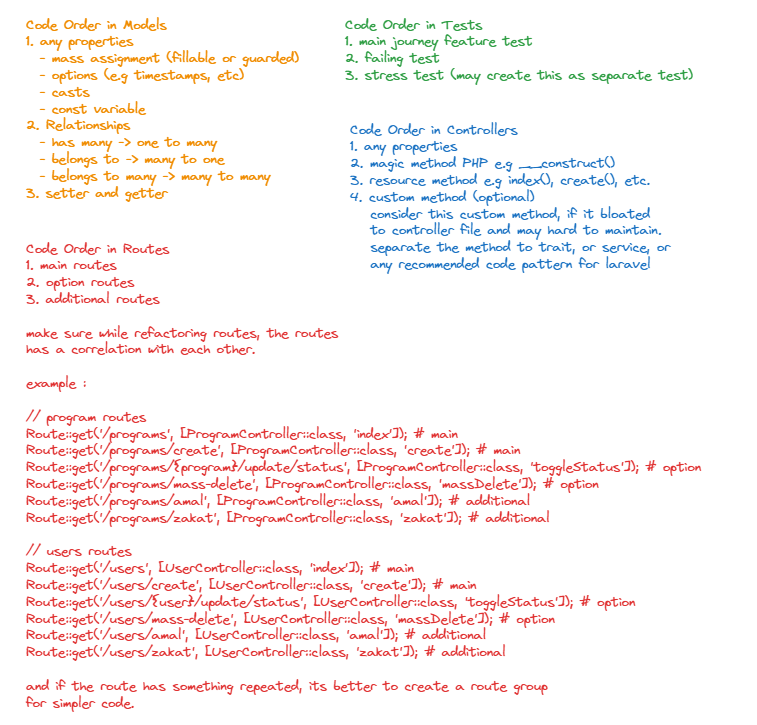

# Code Structure

## Introduction

the code structure is very necessary to make our code more consistent and neater, this will make the code that we create easy for others to understand when reading it. Code structuring is also important to keep the source code easy to maintain, debug, and highly scalable.

<figure><figcaption></figcaption></figure>

## **Single responsibility principle**

A class and a method should have only one responsibility.

❌

```php
public function getFullNameAttribute()
{
    if (auth()->user() && auth()->user()->hasRole('client') && auth()->user()->isVerified()) {
        return 'Mr. ' . $this->first_name . ' ' . $this->middle_name . ' ' . $this->last_name;
    } else {
        return $this->first_name[0] . '. ' . $this->last_name;
    }
}
```

✅

```php
public function getFullNameAttribute(): bool
{
    return $this->isVerifiedClient() ? $this->getFullNameLong() : $this->getFullNameShort();
}

public function isVerifiedClient(): bool
{
    return auth()->user() && auth()->user()->hasRole('client') && auth()->user()->isVerified();
}

public function getFullNameLong(): string
{
    return 'Mr. ' . $this->first_name . ' ' . $this->middle_name . ' ' . $this->last_name;
}

public function getFullNameShort(): string
{
    return $this->first_name[0] . '. ' . $this->last_name;
}
```

## **Fat models and skinny controllers**

write the DB logic (if the logic has a certain complexity) in the Model. or you can also use the [repository pattern](https://dev.to/carlomigueldy/getting-started-with-repository-pattern-in-laravel-using-inheritance-and-dependency-injection-2ohe).

<figure><figcaption><p>diagram for repository pattern</p></figcaption></figure>

❌

```php
public function index()
{
    $clients = Client::verified()
        ->with(['orders' => function ($q) {
            $q->where('created_at', '>', Carbon::today()->subWeek());
        }])
        ->get();

    return view('index', ['clients' => $clients]);
}
```

✅

```php
public function index()
{
    return view('index', ['clients' => $this->client->getWithNewOrders()]);
}

class Client extends Model
{
    public function getWithNewOrders(): Collection
    {
        return $this->verified()
            ->with(['orders' => function ($q) {
                $q->where('created_at', '>', Carbon::today()->subWeek());
            }])
            ->get();
    }
}
```

## Validation

validation must be written in the request class.

❌

<pre class="language-php"><code class="lang-php"><strong>// in the controller
</strong><strong>public function store(Request $request)
</strong>{
    $request->validate([
        'title' => 'required|unique:posts|max:255',
        'body' => 'required',
        'publish_at' => 'nullable|date',
    ]);

    ....
}
</code></pre>

✅

```php
public function store(PostRequest $request)
{    
    ....
}

class PostRequest extends Request
{
    public function rules(): array
    {
        return [
            'title' => ['required', 'unique:posts', 'max:255'],
            'body' => ['required'],
            'publish_at' => ['nullable', 'date'],
        ];
    }
}
```

## **Business logic should be in the service class**

A controller must have only one responsibility, so move business logic from controllers to service classes.

❌

```php
public function store(Request $request)
{
    if ($request->hasFile('image')) {
        $request->file('image')->move(public_path('images') . 'temp');
    }
    
    ....
}
```

✅

```php
public function store(Request $request)
{
    /**
    * $this->articleService is from dependency injection,
    * may be called on __construct() method.
    */
    $this->articleService->handleUploadedImage($request->file('image'));

    ....
}

class ArticleService
{
    public function handleUploadedImage($image): void
    {
        if (!is_null($image)) {
            $image->move(public_path('images') . 'temp');
        }
    }
}
```

## **Don't repeat yourself (DRY)**

Reuse code when you can. SRP is helping you to avoid duplication. Also, reuse Blade templates, use Eloquent scopes, etc.

❌

<pre class="language-php"><code class="lang-php"><strong>// in the models
</strong><strong>public function getActive()
</strong>{
    return $this->where('verified', 1)->whereNotNull('deleted_at')->get();
}

public function getArticles()
{
    return $this->whereHas('user', function ($q) {
            $q->where('verified', 1)->whereNotNull('deleted_at');
        })->get();
}
</code></pre>

✅

```php
// in the models
public function scopeActive($q)
{
    return $q->where('verified', true)->whereNotNull('deleted_at');
}

public function getActive(): Collection
{
    return $this->active()->get();
}

public function getArticles(): Collection
{
    return $this->whereHas('user', function ($q) {
            $q->active();
        })->get();
}
```

## **Prefer to use Eloquent over using Query Builder and raw SQL queries. Prefer collections over arrays**

eloquent helps us to write code that is easy to maintain and easy to read. Also, Eloquent has powerful built-in features.

Instead of using a raw array, we'd better convert the array to a collection so that we can use the powerful built-in features of the Laravel collection.

## **Mass assignment**

prefer using mass assignment method.

❌

```php
$article = new Article;
$article->title = $request->title;
$article->content = $request->content;
$article->verified = $request->verified;
// Add a category to an article
$article->category_id = $category->id;
$article->save();
```

✅

```php
$category->article()->create($request->validated());
```

## **Do not execute queries in Blade templates and use eager loading (N + 1 problem)**

executing queries is not the blade templates responsibility, the blade template must accept just result data (e.g from the controller).

❌

```php
@foreach (User::all() as $user)
    {{ $user->profile->name }}
@endforeach
```

✅

```php
// from controller
$users = User::with('profile')->get();

...

@foreach ($users as $user)
    {{ $user->profile->name }}
@endforeach
```

## **Chunk data for data-heavy tasks**

you may chunk the data if the app gets the heavy task of data.

❌

```php
$users = $this->get();

foreach ($users as $user) {
    ...
}
```

✅

```php
$this->chunk(500, function ($users) {
    foreach ($users as $user) {
        ...
    }
});
```

## **Prefer descriptive method and variable names over comments**

write the code that can describe itself if possible

❌

```php
// Determine if there are any joins
if (count((array) $builder->getQuery()->joins) > 0)
```

✅

```php
if ($this->hasJoins())
```

## **Do not put JS and CSS in Blade templates and do not put any HTML in PHP classes**

you may not mix JS code or CSS code inside blade templates and do not put any HTML in the PHP class whenever possible, this will lead you and other people when reading the code to [context switching](https://en.wikipedia.org/wiki/Context\_switch) problems.

❌

```jsx
let article = `{{ json_encode($article) }}`;
```

✅ better :

```html
<input id="article" type="hidden" value='@json($article)'>

Or

<button class="js-fav-article" data-article='@json($article)'>{{ $article->name }}<button>
```

✅ in javascript file

```jsx
let article = $('#article').val();
```

## **Use config, language files, and constants instead of text in the code**

❌

```php
public function isNormal(): bool
{
    return $article->type === 'normal';
}

return back()->with('message', 'Your article has been added!');
```

✅

```php
public function isNormal()
{
    return $article->type === Article::TYPE_NORMAL;
}

return back()->with('message', __('app.article_added'));
```

## **Use standard Laravel tools accepted by community**

Prefer to use built-in Laravel functionality and community packages instead of using 3rd party packages and tools. Any developer who will work with your app in the future will need to learn new tools. Also, chances to get help from the Laravel community are significantly lower when you're using a 3rd party package or tool. Do not make your client pay for that.

| Task                      | Standard tools                         | 3rd party tools                                         |
| ------------------------- | -------------------------------------- | ------------------------------------------------------- |
| Authorization             | Policies                               | Entrust, Sentinel and other packages                    |
| Compiling assets          | Laravel Mix, Vite                      | Grunt, Gulp, 3rd party packages                         |
| Development Environment   | Laravel Sail, Homestead                | Docker                                                  |
| Deployment                | Laravel Forge                          | Deployer and other solutions                            |
| Unit testing              | PHPUnit, Mockery                       | Phpspec, Pest                                           |
| Browser testing           | Laravel Dusk                           | Codeception                                             |
| DB                        | Eloquent                               | SQL, Doctrine                                           |
| Templates                 | Blade                                  | Twig                                                    |
| Working with data         | Laravel collections                    | Arrays                                                  |
| Form validation           | Request classes                        | 3rd party packages, validation in controller            |
| Authentication            | Built-in                               | 3rd party packages, your own solution                   |
| API authentication        | Laravel Passport, Laravel Sanctum      | 3rd party JWT and OAuth packages                        |
| Creating API              | Built-in                               | Dingo API and similar packages                          |
| Working with DB structure | Migrations                             | Working with DB structure directly                      |
| Localization              | Built-in                               | 3rd party packages                                      |
| Realtime user interfaces  | Laravel Echo, Pusher                   | 3rd party packages and working with WebSockets directly |
| Generating testing data   | Seeder classes, Model Factories, Faker | Creating testing data manually                          |
| Task scheduling           | Laravel Task Scheduler                 | Scripts and 3rd party packages                          |
| DB                        | MySQL, PostgreSQL, SQLite, SQL Server  | MongoDB                                                 |

## **Use shorter and more readable syntax where possible**

less is more.

❌

```php
$request->session()->get('cart');
$request->input('name');
```

✅

```php
session('cart');
$request->name;
```

more examples:

| Common syntax                                                          | Shorter and more readable syntax                                       |
| ---------------------------------------------------------------------- | ---------------------------------------------------------------------- |
| `Session::get('cart')`                                                 | `session('cart')`                                                      |
| `$request->session()->get('cart')`                                     | `session('cart')`                                                      |
| `Session::put('cart', $data)`                                          | `session(['cart' => $data])`                                           |
| `$request->input('name'), Request::get('name')`                        | `$request->name, request('name')`                                      |
| `return Redirect::back()`                                              | `return back()`                                                        |
| `is_null($object->relation) ? null : $object->relation->id`            | `optional($object->relation)->id` (in PHP 8: `$object->relation?->id`) |
| `return view('index')->with('title', $title)->with('client', $client)` | `return view('index', compact('title', 'client'))`                     |
| `$request->has('value') ? $request->value : 'default';`                | `$request->get('value', 'default')`                                    |
| `Carbon::now(), Carbon::today()`                                       | `now(), today()`                                                       |
| `App::make('Class')`                                                   | `app('Class')`                                                         |
| `->where('column', '=', 1)`                                            | `->where('column', 1)`                                                 |
| `->orderBy('created_at', 'desc')`                                      | `->latest()`                                                           |
| `->orderBy('age', 'desc')`                                             | `->latest('age')`                                                      |
| `->orderBy('created_at', 'asc')`                                       | `->oldest()`                                                           |
| `->select('id', 'name')->get()`                                        | `->get(['id', 'name'])`                                                |
| `->first()->name`                                                      | `->value('name')`                                                      |

## **Use IoC container or facades instead of new Class**

new Class syntax creates tight coupling between classes and complicates testing. Use [IoC container](https://laravel.com/docs/4.2/ioc) or facades instead.

❌

```php
$user = new User;
$user->create($request->validated());
```

✅

```php
public function __construct(User $user)
{
    $this->user = $user;
}

....

$this->user->create($request->validated());
```

## **Do not get data from the `.env` file directly**

Pass the data to config files instead and then use the `config()` helper function to use the data in an application.

❌

```php
$apiKey = env('API_KEY');
```

✅

```php
// config/api.php
'key' => env('API_KEY'),

// Use the data
$apiKey = config('api.key');
```

## **Store dates in the standard format. Use accessors and mutators to modify date format**

reference:

* [previous version (accessors and mutators)](https://laravel.com/docs/8.x/eloquent-mutators#accessors-and-mutators)
* [new version (accessors and mutators)](https://laravel.com/docs/9.x/eloquent-mutators#accessors-and-mutators)

❌

```php
{{ Carbon::createFromFormat('Y-d-m H-i', $object->ordered_at)->toDateString() }}
{{ Carbon::createFromFormat('Y-d-m H-i', $object->ordered_at)->format('m-d') }}
```

✅

```php
// Model
protected $dates = ['ordered_at', 'created_at', 'updated_at'];
public function getSomeDateAttribute($date)
{
    return $date->format('m-d');
}

// View
{{ $object->ordered_at->toDateString() }}
{{ $object->ordered_at->some_date }}
```

## Code Order Refactoring Good Practice

<figure><figcaption></figcaption></figure>
