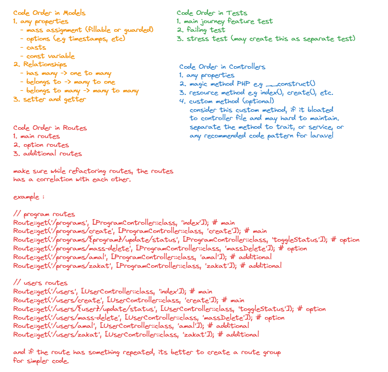

# Other Good Practice & Tips

### Code Order Refactoring Good Practice

<figure><figcaption></figcaption></figure>

### Other Good Practice

* Avoid using patterns and tools that are alien[^1] to Laravel and similar frameworks (i.e. RoR, Django). If you like Symfony (or Spring) approach for building apps, it's a good idea to use these frameworks instead.
* Never put any logic in route files.
* Minimize (or never use) the usage of vanilla PHP in Blade templates.
* Use in-memory[^2] DB for testing.
* Do not override [standard framework features](#user-content-fn-3)[^3] to avoid problems related to updating the framework version and many other issues.
* Use modern PHP syntax where possible, but don't forget about readability.
* Avoid using [View Composers](https://laravel.com/docs/views#view-composers) and similar tools unless you really know what you're doing. In most cases, there is a better way to solve the problem.

[^1]: this means the tools or library is not native compatible or supported to laravel or PHP

[^2]: config in phpunit.xml

[^3]: e.g code inside vendor folder or library code
